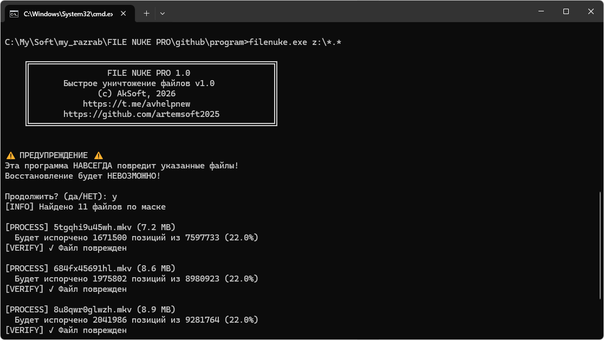
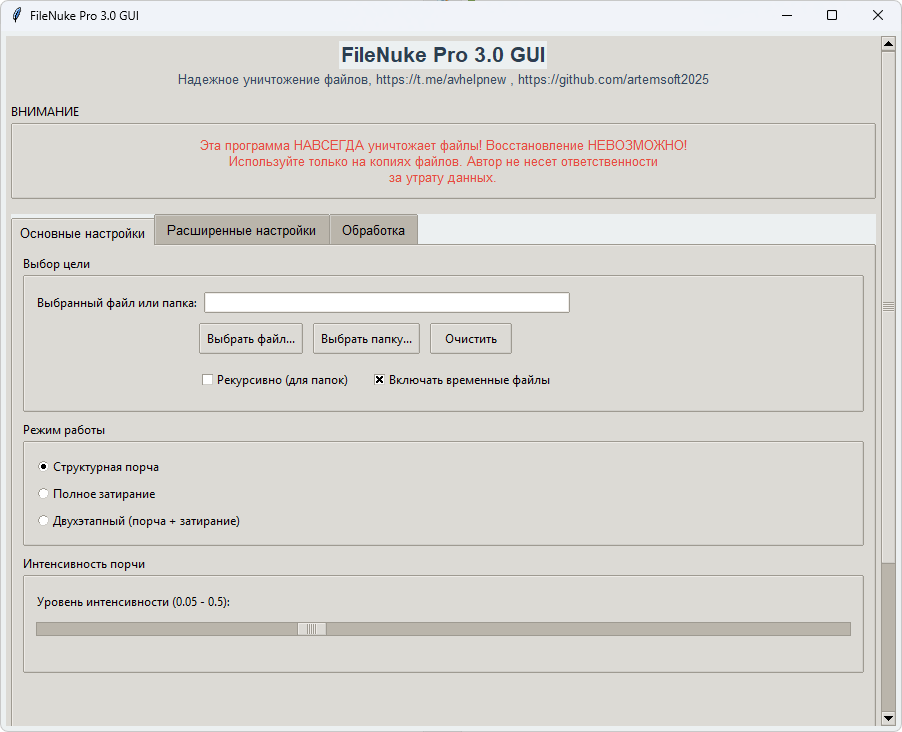

# FILE NUKE PRO 3.0

[Скачать релиз](https://github.com/artemsoft2025/FileNuke-Pro/releases/)

Данная программа предназначена для **намеренного повреждения файлов**, а также их классического **«затирания»**.
Усовершенствованный гибридный инструмент для надёжного уничтожения файлов.
Структурная порча + безопасное затирание в одной программе.

Для надёжного удаления данных с флешки недостаточно просто стереть файлы, необходимо заполнить свободное место. Этот процесс долог и изнашивает накопитель. Альтернатива — затирание самого файла — также не даёт гарантии из-за особенностей флеш-памяти. Программа для стирания может показать успешное выполнение, но её обманут кэширование операционной системы и внутренний механизм выравнивания износа контроллера флешки, который перенаправляет запись в разные физические ячейки. Таким образом, следы файла могут остаться в памяти.

Поэтому эта программа поможет:
1. Когда нет времени/жалко диск. Файлы будут испорчены быстро и надежно.
2. Параноидальная защита - испортить файл, а потом уничтожить его другой популярной программой или параметр --two-pass в filenuke.






---

# В чем уникальность FileNuke Pro

FileNuke Pro - это **гибридный** инструмент, который сочетает два подхода:

1. **Умная структурная порча** - анализирует тип файла и целенаправленно разрушает его критичные области, программы для восстановления данных не помогут (R.saver,  R-Studio, Recuva). Возможно дорогая криминалистика и поможет восстановить файлы удаленные данным способом, но главный смысл тут в том, что рядовые пользователи не смогу восстановить ваши данные без огромного вложения финансовых средств (взамен получаем экономию времени и ресурсов диска).
Конечно, txt-файлы после порчи можно будет изучить почти полностью, но архивы, видео, фото, документы будут безнадежно испорчены. Но не забывайте, что теперь программа также может полностью затереть файлы - тут уже без вариантов для восстановления.
И filenuke не удаляет файл после затирания - пользователь может убедиться в эффективности и удалить файл обычным способом. 
2. **Полное затирание** - реализует стандарты безопасного удаления данных. Криминалистика тут уже не поможет. 

В отличие от других программ:

- Видимый результат - файл можно проверить ДО удаления
- Интеллектуальный анализ - программа "понимает", что портить в разных типах файлов
- Гибридный подход - можно использовать порчу ИЛИ затирание ИЛИ оба подхода
- Безопасность - встроенные проверки защищают от случайного повреждения системных файлов
- Параллельная обработка - быстро работает с большими наборами файлов

---

# Сравнение методов

|Метод	| Время	| Восстановление	| Лучше всего для |
|-------|-------|-------------------|-----------------|
|Структурная порча |	Быстро	| Невозможно обычными средствами	| Повседневное использование, HDD/SSD |
|Затирание (3 прохода)	| Средне	| Невозможно даже криминалистикой	| Конфиденциальные данные |
|Two-Pass режим	| Дольше	| Полная невозможность	| Максимальная безопасность |

---


# Возможности версии 3.3

## Улучшенный анализ файлов

- Автоматическое определение типов файлов (текст/бинарный/архив/медиа)
- Категоризация файлов (обычные/временные/скрытые)
- Умный выбор областей для порчи

## Новые режимы работы
- Two-Pass режим: Сначала порча, затем полное затирание (максимальная безопасность)
- Wipe-Only режим: Только полное затирание (классический подход)
- Гибридный режим: Выбор подхода в зависимости от типа файла

## Производительность
- Параллельная обработка (до 32 потоков)
- Оптимизированные алгоритмы для больших файлов
- Минимальное потребление памяти

## Безопасность
- Проверка системных путей
- Защита от случайного повреждения
- Контроль прав доступа
- Подтверждение действий

# Как это работает

## Для текстовых файлов:
- Порча заголовков
- Разрушение структуры строк
- Добавление мусорных данных
- Корректировка контрольных сумм

## Для бинарных файлов:
- Порча сигнатур
- Разрушение заголовков структур
- Порча точек входа (для EXE)
- Разрушение таблиц данных

## Для медиафайлов:
- Порча заголовков контейнеров
- Разрушение ключевых кадров
- Порча метаданных
- Коррупция кодека

# Примеры использования

```cmd
Пример 1: Быстрая порча временных файлов
filenuke.exe "C:\temp\*.tmp" -i 0.4 -R --parallel
Интенсивная порча с переименованием, параллельная обработка

Пример 2: Уничтожение конфиденциальных документов
filenuke.exe "секретные_документы/" -r --two-pass --passes 5
Рекурсивная обработка, двухэтапный режим с 5 проходами затирания

Пример 3: Безопасная очистка USB-накопителя
filenuke.exe "D:\private_data\" --wipe-only --standard dod --passes 7
*Военный стандарт DoD 5220.22-M, 7 проходов затирания*

Пример 4: Выборочное уничтожение
filenuke.exe "*.jpg" --intensity 0.3 --keep-time
Порча только JPG файлов с сохранением дат создания
```


# Параметры командной строки

```cmd
Основные параметры

target                   Файл, директория или шаблон для обработки
-i, --intensity FLOAT   Интенсивность порчи (0.05-0.95, по умолчанию 0.2)
-r, --recursive         Рекурсивная обработка директорий
-R, --rename            Переименовывать файлы после порчи
--aggressive-rename     Агрессивное переименование (несколько раз)
-f, --force             Принудительная обработка (опасно!)
-t, --keep-time         Сохранить оригинальное время файла
--skip-hidden           Пропускать скрытые файлы
Режимы работы

--two-pass              Двухэтапный режим (порча + затирание)
--wipe-only             Только полное затирание (без структурной порчи)
Параметры затирания

--passes INT            Количество проходов затирания (1-35, по умолчанию 3)
--standard              Стандарт затирания [simple|quick|dod|gutmann|hMG|vsitr]
Производительность

--parallel              Параллельная обработка файлов
--workers INT           Количество рабочих потоков (1-32, по умолчанию 4)
Выходные параметры

-q, --quiet             Тихий режим (минимальный вывод)
--test                  Тестовый режим (без реальных изменений)
--benchmark             Режим бенчмарка (тестирование скорости)

Стандарты затирания
Стандарт	Проходы	Описание
simple	1	Один проход нулями (быстро)
quick	3	Три прохода (рекомендуется)
dod	3	DoD 5220.22-M (военный стандарт США)
gutmann	7	Упрощенный алгоритм Гутмана
hMG	6	British HMG IS5
vsitr	4	Российский ГОСТ
```


# Результаты обработки

Программа предоставляет детальный отчет:
- Количество обработанных файлов
- Объем уничтоженных данных
- Статистика по типам файлов
- Скорость обработки
- Список ошибок (если есть)

# ВАЖНЫЕ ПРЕДУПРЕЖДЕНИЯ

НЕОБРАТИМОСТЬ - программа НАВСЕГДА уничтожает файлы

ТЕСТИРОВАНИЕ - всегда тестируйте на копиях

СИСТЕМНЫЕ ФАЙЛЫ - используйте --force только если уверены

ДВУХЭТАПНЫЙ РЕЖИМ - восстановление невозможно даже для криминалистики

## Примеры предупреждений программы
```cmd
==========================================================
ВНИМАНИЕ: ЭТА ПРОГРАММА НАВСЕГДА УНИЧТОЖАЕТ ФАЙЛЫ!
          ВОССТАНОВЛЕНИЕ НЕВОЗМОЖНО!
==========================================================

⚡ ВКЛЮЧЕН ПРИНУДИТЕЛЬНЫЙ РЕЖИМ!
⚡ СИСТЕМНЫЕ ФАЙЛЫ МОГУТ БЫТЬ ПОВРЕЖДЕНЫ!

⚠ АКТИВИРОВАН ДВУХЭТАПНЫЙ РЕЖИМ!
⚠ Восстановление невозможно даже для криминалистики!

⚠ 7 ПРОХОДОВ ЗАТИРАНИЯ!
⚠ Соответствует военным стандартам уничтожения данных!
```


# Проверка результатов

После обработки файла:
- Попробуйте открыть файл в соответствующей программе
- Проверьте размер файла (должен остаться прежним)
- Просмотрите hex-редактором для уверенности
- Только после проверки удаляйте файл

# Поддержка
Телеграм: https://t.me/avhelpnew

Почта: artemsoft@yahoo.com

GitHub: https://github.com/artemsoft2025

Исходный код: https://github.com/artemsoft2025/FileNuke-Pro

# Лицензия
Программа предоставляется "как есть". Автор не несет ответственности за любой ущерб, вызванный использованием этой программы.

Используйте ответственно!

# FAQ
Q: Безопасно ли использовать программу на SSD?

A: Да, но учитывайте, что физическое уничтожение на SSD сложнее из-за wear leveling.

Q: Можно ли восстановить файлы после two-pass режима?

A: Нет, это комбинация структурной порчи и многопроходного затирания.


© AkSoft, 2026


